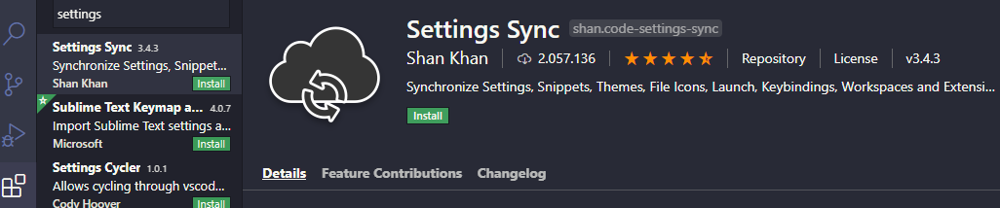
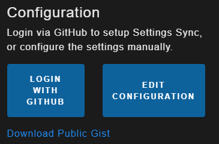
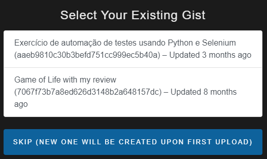
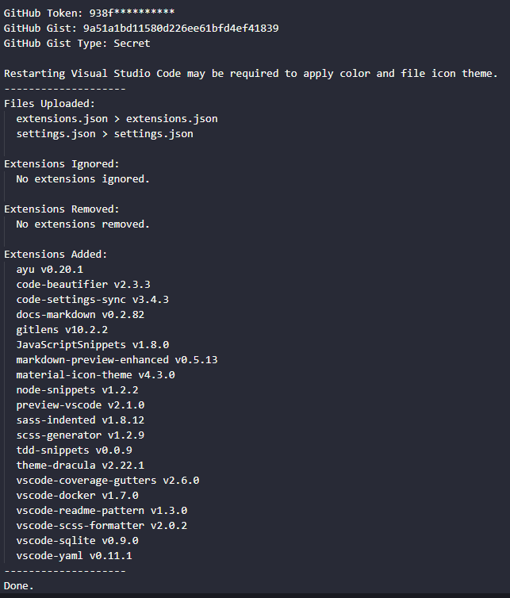

# Instalando e usando o Settings Sync

Settings Sync é uma ferramenta para você sincronizar suas configurações de VSCode em qualquer máquina. 
Neste tutorial será mostrado como instalá-lo e utilizá-lo.

## 1. Instalando o Setting Sync no VSCode

O plugin que deverá ser instalado é o seguinte:

Assim que instalar, será aberta uma página. Lá, entre com sua conta do Github:

Após feito o login, selecione um gist para armasenar as configurações do VSCode (ou selecione para criar um novo automaticamente):

## 2. Fazendo upload de suas configurações do VSCode

Para fazer o upload de suas configurações, use `Shift+Alt+U`. Ele irá criar um gist (ou sobreescrever um) com todas suas configurações do VSCode.

## 3. Fazendo download de suas configurações do VSCode

Para fazer o download de suas configurações, use `Shift+Alt+D`. As configurações no gist irão ser passadas para o VSCode automaticamente. No meu caso, já estava tudo configurado:

## 4. Resetando as configurações do VSCode

Caso queira resetar as configurações, use `Ctrl+Shift+P` e busque `"Sync: Reset Extension Settings"`.

## OBSERVAÇÕES

### Auto Download

O download automático não é habilitado por default. Para habilitá-lo, primeiro verifique se está tudo certo com a vinculação com o Github e se o gist já está disponível (ou seja, se você já fez upload de alguma configuração). Feito isso, use `Ctrl+Shift+P` e v `"Sync: Advance Options > Toggle Auto-Download On Startup"`.

### Criando um gist público

O Settings Sync cria um gist privado por default. Mas caso você queira criar um gist público para compartilhar suas configurações, use `Ctrl+Shift+P` e v `"SSync : Advance Options > Share Settings with Public GIST"`.